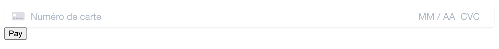

# Payum Stripe js gateway

See https://stripe.com/docs/payments for more information.

This simple implementation allow you to create a `PaymentIntent` using Stripe Elements to pay something, here is the actual render of it :



# Get it started

First get [your credentials](../stripe-credentials.md) from Stripe dashboard.

 > The following example is the basic Payum implementation
 > (see [documentation of Payum](https://github.com/Payum/Payum/blob/master/docs/get-it-started.md) for more information)

### config.php

```php
<?php

declare(strict_types=1);

$loader = require_once( __DIR__.'/vendor/autoload.php');

use Payum\Core\GatewayFactoryInterface;
use FluxSE\PayumStripe\StripeCheckoutSessionGatewayFactory;
use Payum\Core\PayumBuilder;
use Payum\Core\Payum;

/** @var Payum $payum */
$payum = (new PayumBuilder())
    ->addDefaultStorages()
    ->addGatewayFactory('stripe_js', function(array $config, GatewayFactoryInterface $coreGatewayFactory) {
        return new StripeCheckoutSessionGatewayFactory($config, $coreGatewayFactory);
    })
    ->addGateway('stripe_js', [
        'factory' => 'stripe_js',
        'publishable_key' => 'pk_test_abcdefghijklmnopqrstuvwx',
        'secret_key' => 'sk_test_abcdefghijklmnopqrstuvwx',
        'webhook_secret_keys' => [
            'whsec_abcdefghijklmnopqrstuvwxyz012345'
        ],
    ])
    ->getPayum()
;
```

### prepare.php

```php
<?php

declare(strict_types=1);

include __DIR__.'/config.php';

use Payum\Core\Model\Payment;

$gatewayName = 'stripe_js';

$storage = $payum->getStorage(Payment::class);

/** @var Payment $payment */
$payment = $storage->create();
$payment->setNumber(uniqid());
$payment->setCurrencyCode('EUR');
$payment->setTotalAmount(123); // 1.23 EUR
$payment->setDescription('A description');
$payment->setClientId('anId');
$payment->setClientEmail('foo@example.com');
$payment->setDetails([]);

$storage->update($payment);

$tokenFactory = $payum->getTokenFactory();
$captureToken = $tokenFactory->createCaptureToken($gatewayName, $payment, 'done.php');

header("Location: ".$captureToken->getTargetUrl());
```

### capture.php

```php
<?php

declare(strict_types=1);

use Payum\Core\Reply\HttpResponse;
use Payum\Core\Request\Capture;
use Payum\Core\Reply\HttpRedirect;

include __DIR__.'/config.php';

$token = $payum->getHttpRequestVerifier()->verify($_REQUEST);
$gateway = $payum->getGateway($token->getGatewayName());

if ($reply = $gateway->execute(new Capture($token), true)) {
    if ($reply instanceof HttpRedirect) {
        header("Location: ".$reply->getUrl());
        die();
    }
    if ($reply instanceof HttpResponse) {
        echo $reply->getContent();
        die();
    }

    throw new \LogicException('Unsupported reply', null, $reply);
}

$payum->getHttpRequestVerifier()->invalidate($token);

header("Location: ".$token->getAfterUrl());
```

### done.php

```php
<?php

declare(strict_types=1);

use Payum\Core\Request\GetHumanStatus;

include __DIR__.'/config.php';

$token = $payum->getHttpRequestVerifier()->verify($_REQUEST);
$gateway = $payum->getGateway($token->getGatewayName());

// you can invalidate the token. The url could not be requested any more.
// $payum->getHttpRequestVerifier()->invalidate($token);

// Once you have token you can get the model from the storage directly.
//$identity = $token->getDetails();
//$payment = $payum->getStorage($identity->getClass())->find($identity);

// or Payum can fetch the model for you while executing a request (Preferred).
$gateway->execute($status = new GetHumanStatus($token));
$payment = $status->getFirstModel();

header('Content-Type: application/json');
echo json_encode([
    'status' => $status->getValue(),
    'order' => [
        'total_amount' => $payment->getTotalAmount(),
        'currency_code' => $payment->getCurrencyCode(),
        'details' => $payment->getDetails(),
    ],
], JSON_PRETTY_PRINT);
```

## Webhooks

For generic info on Stripe webhooks read this :
https://stripe.com/docs/webhooks

### How the webhooks are handle into this gateway ?

The starting point is always an `Action` with Payum and generically you have to use `Notify*Action` to handle webhooks.

Because we have to set a static url on Stripe backend (eg: without any token variable params),
we have to use what Payum is calling a `NotifyUnsafe`, it's a `Notify` with a `null` `Token`.
You can find this action here : [`NotifyAction.php`](../../src/Action/NotifyAction.php).
If the token is null then we will try to handle a webhook, and if a token is detected
then it's a normal `Notify` so we must handle a `Sync` to refresh a payment details.

#### Resolving a webhook : `NotifyUnsafe`

The [`NotifyAction.php`](../../src/Action/NotifyAction.php) will ask for 2 other actions to :

1. Resolve the webhook event, meaning :
    - retrieve the Stripe signature in the request headers.
    - try to construct the webhook `Event` object, checking it with the webhook secret key.
2. Give this resolved `Event` to an `Action` able to consume this `Event`.

So if you want to consume another webhook event type, you just need to create an `Action`
extending [`FluxSE\PayumStripe\Action\Api\WebhookEvent\AbstractWebhookEventAction`](../../src/Action/Api/WebhookEvent/AbstractWebhookEventAction.php).
Examples available into the [`src/Action/Api/WebhookEvent/`](../../src/Action/Api/WebhookEvent) folder.

## More

 - A Symfony bundle : [flux-se/payum-stripe-checkout-bundle](https://github.com/FLUX-SE/PayumStripeBundle)
 - A Sylius plugin : [flux-se/sylius-payum-stripe-checkout-session-plugin](https://github.com/FLUX-SE/SyliusPayumStripePlugin)
  